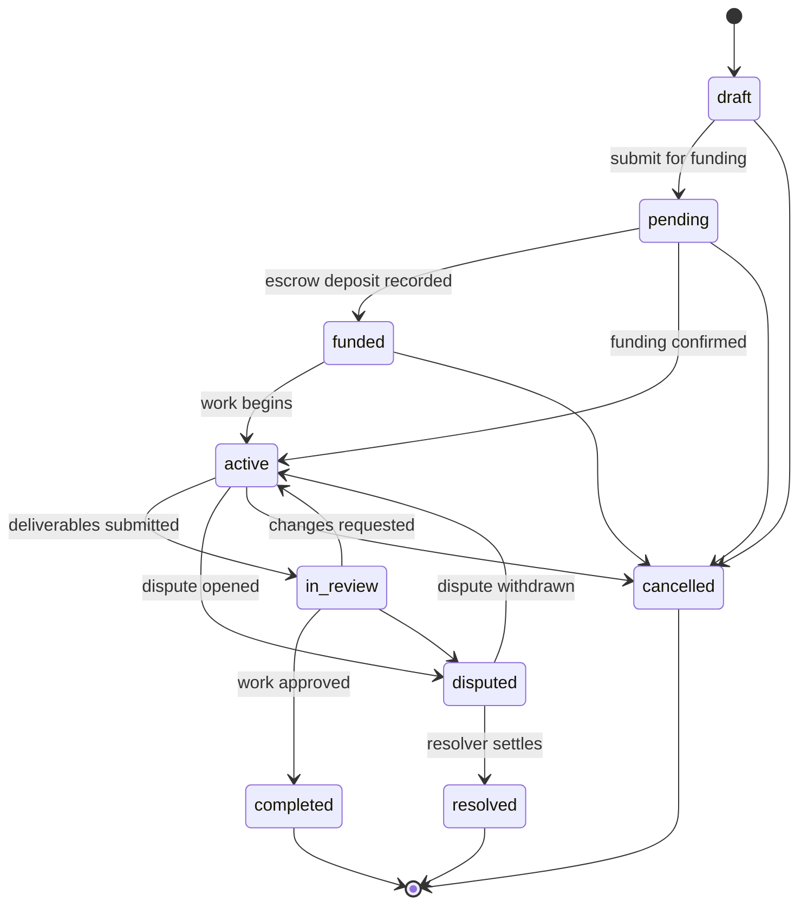

# Agreement Lifecycle

The agreement status state machine is declared in
[`src/agreements/agreement-lifecycle.ts`](../src/agreements/agreement-lifecycle.ts)
and enforced by `AgreementsService.updateStatus`. Any `PATCH /v1/agreements/:id/status`
request that is not a declared transition is rejected with `400 Bad Request`.

## Status vocabulary

| Conceptual name | Persisted status | Notes |
| --- | --- | --- |
| Draft | `draft` | Drafted, not yet awaiting funds |
| Pending Funding | `pending` | Default status on creation |
| Funded | `funded` | Escrow funded (`funded_at` stamped) |
| Active | `active` | Work in progress |
| In Review | `in_review` | Deliverables awaiting approval |
| Completed | `completed` | Terminal (`completed_at` stamped) |
| Disputed | `disputed` | Open dispute on the agreement |
| Resolved | `resolved` | Terminal, settled by a resolver |
| Cancelled | `cancelled` | Terminal |

## Business rules enforced on transition

- Only declared transitions are accepted; terminal statuses (`completed`,
  `resolved`, `cancelled`) accept none.
- Transitioning to `completed` requires every milestone to be `approved` or
  `released` (agreements without milestones may complete). Dispute
  resolution (`resolved`) is exempt — payouts are decided by the resolver.
- Only the creator or a participant of the agreement may transition it, and
  `actor_wallet` must match the authenticated user's wallet.
- Every successful transition appends an `agreement_activity` row
  (`status_changed_to_<status>` with `{ from, to }` details) and emits
  `agreement.funded` / `agreement.completed` events where applicable.

## Adding a new state

1. Add the status to `AGREEMENT_STATUSES` and declare its edges in
   `AGREEMENT_TRANSITIONS`.
2. Run the lifecycle suite (`npx jest agreement-lifecycle`). The exhaustive
   valid/invalid transition matrices and the service-level enforcement sweep
   are derived from those declarations, so coverage extends automatically;
   add targeted tests only for new business rules attached to the state.
